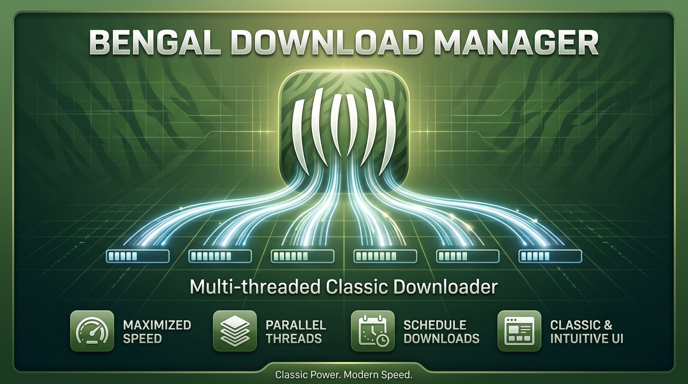
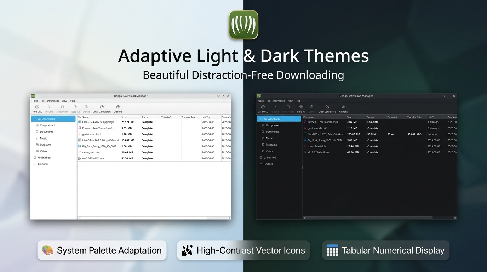
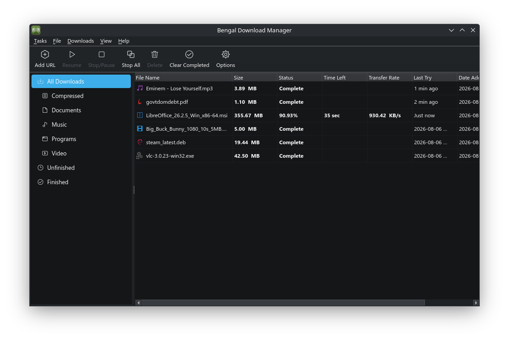
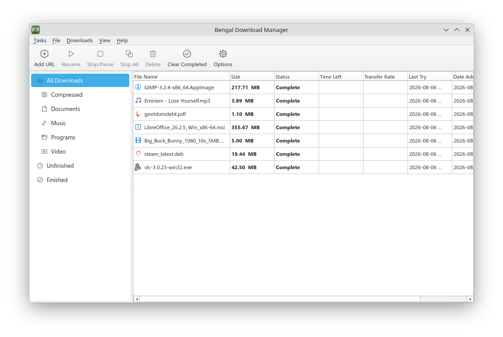
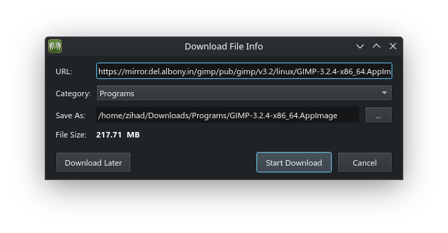
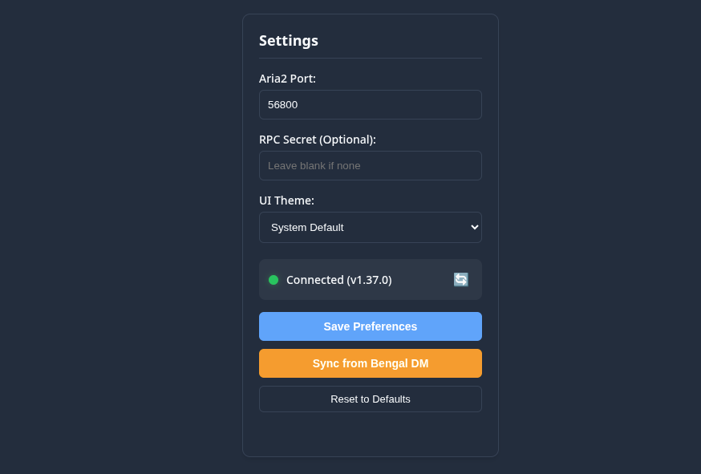
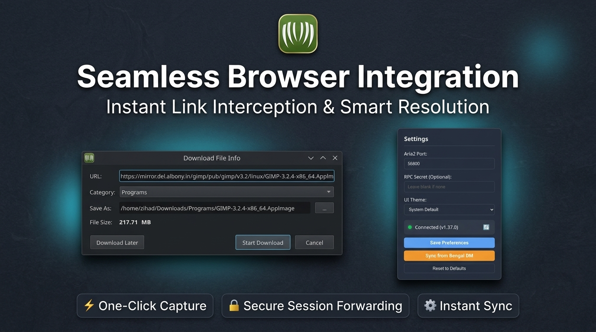
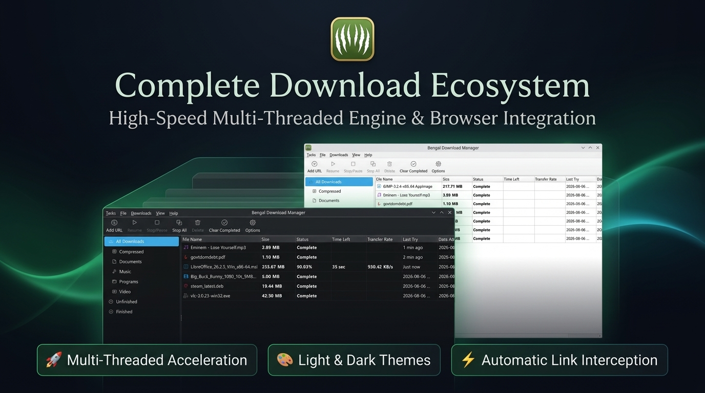

<div align="center">


# Bengal Download Manager

### Downloads, Supercharged.

*Bengal Download Manager is a powerful and efficient download management tool designed to simplify and accelerate your downloading experience.*

[](https://github.com/tazihad/bengal-download-manager/releases/latest)
[](https://github.com/tazihad/bengal-download-manager/releases)
[](LICENSE)
[](#build-instructions)

</div>

<br />

<p align="center">
  
</p>

<p align="center">
  
</p>

Bengal Download Manager is a high-performance download management tool built with PyQt6, KDE Kirigami QML, and Aria2 to accelerate and simplify your download workflow.

## Screenshots & Product Posters

### Main Application (Dark & Light Mode)

<p align="center">
  
  
</p>

### One-Click Browser Integration & Settings

<p align="center">
  
  
</p>

### Feature Branding Posters

<p align="center">
  
</p>

<p align="center">
  
</p>

## Key Features

- ⚡ **Supercharged Speed:** Downloads files in multiple split parts simultaneously to get the absolute maximum speed from your internet connection.
- ⏯️ **Pause & Resume Anytime:** Pause downloads whenever you need, and pick up right where you left off without ever losing progress.
- 🌐 **One-Click Browser Integration:** Automatically catches download links from Firefox, Chrome, Brave, and Edge as soon as you click them.
- 🗂️ **Smart File Organization:** Keeps your downloads tidy by automatically sorting them into clear categories like *Documents*, *Videos*, *Music*, *Compressed*, and *Programs*.
- 🛡️ **Automatic Connection Recovery:** Automatically retries and resumes downloads if your Wi-Fi or internet connection temporarily drops.
- 🎛️ **Bandwidth Speed Controls:** Easily limit download speeds so your video streaming and web browsing stay smooth while downloading in the background.
- 🎨 **Clean Light & Dark Themes:** Enjoy a modern, distraction-free interface that automatically adapts to your preferred light or dark desktop mode.

## Installation

Download pre-built packages from the [Latest Release](https://github.com/tazihad/bengal-download-manager/releases/latest).

### Supported Architectures
- **`x86_64`** (64-bit Intel / AMD)
- **`aarch64` / `arm64`** (64-bit ARM)

### Available Packages

| Format | Supported Architectures | Quick Command / Link |
| :--- | :--- | :--- |
| **AppImage** | `x86_64`, `aarch64` | [Download AppImage](https://github.com/tazihad/bengal-download-manager/releases/latest) |
| **Flatpak** | `x86_64`, `aarch64` | `flatpak install io.github.tazihad.bengal-download-manager.flatpak` |
| **Standalone Binary** | `x86_64`, `aarch64` | [Download Binary Executable](https://github.com/tazihad/bengal-download-manager/releases/latest) |

#### AppImage Quick Start
```bash
chmod +x bengal-download-manager-*-x86_64.AppImage
./bengal-download-manager-*-x86_64.AppImage
```

---

## Browser Extensions

Integrate Bengal Download Manager with your browser for automatic download interception:

- **Firefox Add-ons Store:**  
  [](https://addons.mozilla.org/en-US/firefox/addon/bengal-dm-integration-module)

- **GitHub Release (Offline Zip):**  
  [](https://github.com/tazihad/bengal-download-manager/releases/latest)

- **Google Chrome:**  
  [](#browser-extensions) *(Chrome Web Store release coming soon)*

---

## Build Instructions

### 1. Python Development Mode

Run directly from source (see [DEPENDENCIES.md](DEPENDENCIES.md) for requirements):

```bash
git clone https://github.com/tazihad/bengal-download-manager.git
cd bengal-download-manager
pip install -r requirements.txt
python3 src/main.py
```

### 2. Standalone Binary Build (CMake)

Build a self-contained, single-file binary executable using **CMake** and **PyInstaller**:

```bash
# Ensure dependencies and PyInstaller are installed
pip install -r requirements.txt

# Configure CMake build tree
cmake -B build -S .

# Compile standalone executable
cmake --build build
```

The resulting binary will be generated at:
```bash
./build/dist/bengal-download-manager
```

### 3. Flatpak Package Build

Build and test the Flatpak package locally using the Flatpak manifest:

```bash
bash scripts/build_and_run_flatpak.sh
```

### 4. Browser Extension Packaging

Package the Manifest V3 browser extension zip for Firefox Add-ons (AMO) or Chrome Web Store:

```bash
python3 scripts/pack_extension.py
```

See [extension/README.md](extension/README.md) for step-by-step build instructions, environment requirements, and reviewer documentation.
