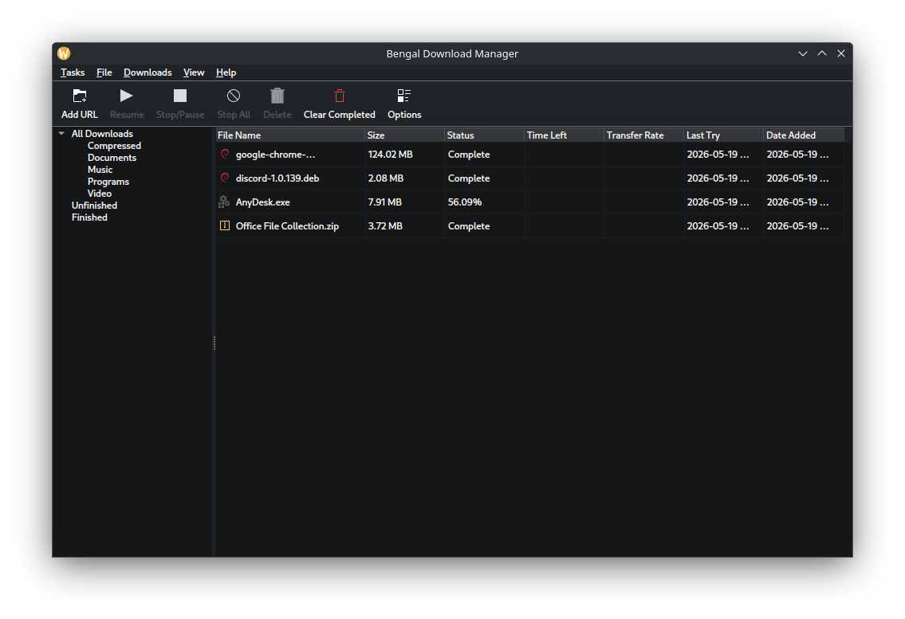

# Bengal Download Manager

Bengal Download Manager is a powerful and efficient download management tool designed to simplify and accelerate your downloading experience.

## Screenshots



## Features

- **Multi-threaded Downloads using aria2:** Download files in multiple parts simultaneously, significantly increasing download speeds using battle tested aria2.
- **Pause and Resume:** Conveniently pause and resume downloads at any time, even after system restarts.
- **Bandwidth Limiting:** Control your download and upload speeds to prevent network congestion.
- **Categorization:** Organize your downloads into different categories for easy management.
- **Browser Integration:** Seamlessly integrate with popular web browsers to capture download links automatically.
- **Error Recovery:** Automatically retry failed downloads due to network issues or other interruptions.
- **User-friendly Interface:** An intuitive and clean interface makes managing your downloads a breeze.

## Build Instructions

### Linux

Build from source (see [DEPENDENCIES.md](DEPENDENCIES.md) for requirements):
   ```bash
   git clone https://github.com/tazihad/bengal-download-manager.git
   cd bengal-download-manager
   ```

   ```sh
   pip install -r requirements.txt
   cmake -S . -B build
   cmake --build build
   ```
   After it finishes, your executable will be located in `build/dist/`
   
