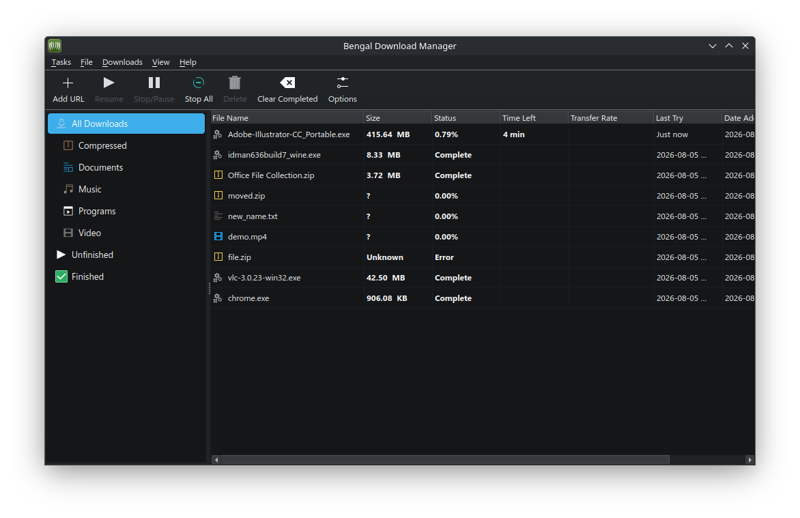

<div align="center">


# Bengal Download Manager

### Downloads, Supercharged.

*Bengal Download Manager is a powerful and efficient download management tool designed to simplify and accelerate your downloading experience.*

[](https://github.com/tazihad/bengal-download-manager/releases/latest)
[](https://github.com/tazihad/bengal-download-manager/releases)
[](LICENSE)
[](#build-instructions)

</div>

<br />

<p align="center">
  
</p>

Bengal Download Manager is a high-performance download management tool built with PyQt6, KDE Kirigami QML, and Aria2 to accelerate and simplify your download workflow.

## Screenshots

<p align="center">
  
</p>

## Features

- **Multi-threaded Downloads using Aria2:** Download files in multiple parts simultaneously, significantly increasing transfer rates.
- **Pause and Resume:** Conveniently pause and resume downloads at any time.
- **Bandwidth Limiting:** Control your download and upload speeds to prevent network congestion.
- **Categorization:** Organize your downloads into different categories for easy management.
- **Browser Integration:** Seamlessly integrate with Chrome, Firefox, Edge, and Brave via Manifest V3 integration module.
- **Error Recovery:** Automatically retry failed downloads due to network interruptions.
- **User-friendly Interface:** Modern PyQt6 and KDE Kirigami interface supporting light and dark themes.

## Build Instructions

### Linux

Build from source (see [DEPENDENCIES.md](DEPENDENCIES.md) for requirements):

```bash
git clone https://github.com/tazihad/bengal-download-manager.git
cd bengal-download-manager
```

```sh
pip install -r requirements.txt
python3 src/main.py
```
