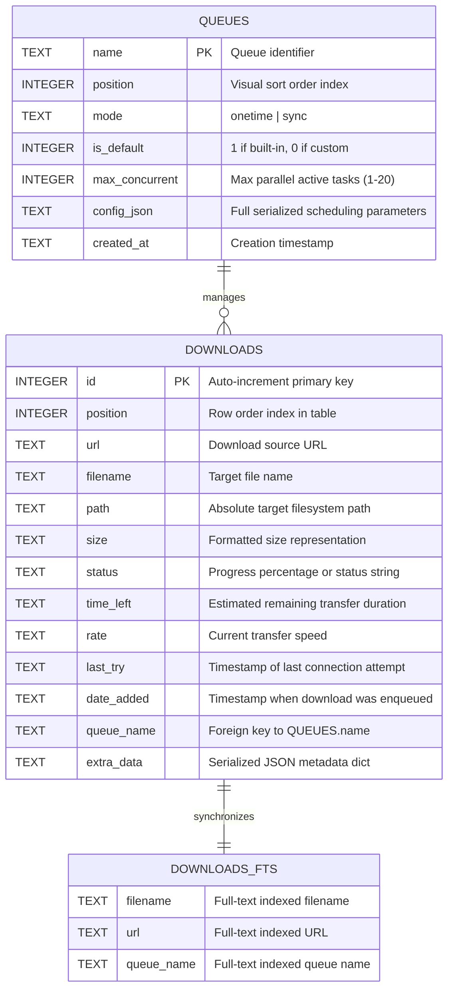

# Bengal Download Manager — Database & Storage Architecture

Bengal Download Manager uses an embedded, high-performance **SQLite 3** persistence engine operating in **Write-Ahead Logging (WAL)** mode. This document outlines the database schema, concurrency safety, indexing strategies, full-text search integration, and filesystem storage layout.

---

## 1. Storage Overview & Database Location

The downloads database is stored at:
```
os.path.join(get_data_dir(), "downloads.db")
```

### Filesystem Storage Paths Across Packaging Targets

| Environment | Configuration Directory (`get_config_dir()`) | Data & Database Directory (`get_data_dir()`) | Temporary Cache (`get_cache_dir()`) |
| :--- | :--- | :--- | :--- |
| **Native Linux** | `~/.config/bengal-download-manager` | `~/.local/share/bengal-download-manager` | `~/.cache/bengal-download-manager/downloads` |
| **Flatpak** | `~/.var/app/io.github.tazihad.bengal-download-manager/config` | `~/.var/app/io.github.tazihad.bengal-download-manager/data` | `~/.var/app/.../cache/downloads` |
| **Snap** | `~/snap/bengal-download-manager/current/.config` | `~/snap/bengal-download-manager/current/.local/share` | `~/snap/.../current/.cache/downloads` |
| **Windows** | `%APPDATA%\bengal-download-manager` | `%LOCALAPPDATA%\bengal-download-manager` | `%TEMP%\bengal-download-manager\downloads` |

---

## 2. Database Pragmas & High-Performance Configuration

Every connection initialized via `get_db_connection()` applies low-latency, crash-resilient SQLite pragmas:

```sql
PRAGMA journal_mode = WAL;
PRAGMA synchronous = NORMAL;
PRAGMA foreign_keys = ON;
PRAGMA cache_size = -64000;
PRAGMA busy_timeout = 5000;
PRAGMA temp_store = MEMORY;
```

### Technical Rationale
- **`journal_mode = WAL`**: Write-Ahead Logging allows background writer threads to persist chunk progress without blocking concurrent read queries from the GUI thread. Readers and writers do not block each other.
- **`synchronous = NORMAL`**: Eliminates redundant `fsync()` system calls during routine checkpoint operations while guaranteeing zero database corruption across power loss in WAL mode.
- **`cache_size = -64000`**: Allocates up to 64 megabytes of RAM page cache, keeping the entire download catalog and index tree resident in memory for instant sorting and filtering.
- **`busy_timeout = 5000`**: Sets a 5-second automatic retry timeout to eliminate `sqlite3.OperationalError: database is locked` errors during burst writes.
- **`temp_store = MEMORY`**: Directs temporary tables, sorting buffers, and index builds to RAM rather than physical disk.

---

## 3. Schema Definitions



### Table 1: `queues`
Defines scheduling queues and recurrence parameters:

```sql
CREATE TABLE IF NOT EXISTS queues (
    name TEXT PRIMARY KEY,
    position INTEGER NOT NULL DEFAULT 0,
    mode TEXT NOT NULL DEFAULT 'onetime',
    is_default INTEGER NOT NULL DEFAULT 0,
    max_concurrent INTEGER NOT NULL DEFAULT 4,
    config_json TEXT NOT NULL DEFAULT '{}',
    created_at TEXT NOT NULL DEFAULT ''
);
```

### Table 2: `downloads`
Main persistence table storing all active and historic downloads:

```sql
CREATE TABLE IF NOT EXISTS downloads (
    id INTEGER PRIMARY KEY AUTOINCREMENT,
    position INTEGER NOT NULL DEFAULT 0,
    url TEXT NOT NULL,
    filename TEXT NOT NULL,
    path TEXT NOT NULL,
    size TEXT NOT NULL DEFAULT '',
    status TEXT NOT NULL DEFAULT 'Queued',
    time_left TEXT NOT NULL DEFAULT '',
    rate TEXT NOT NULL DEFAULT '',
    last_try TEXT NOT NULL DEFAULT '',
    date_added TEXT NOT NULL DEFAULT '',
    queue_name TEXT NOT NULL DEFAULT 'Main download queue',
    extra_data TEXT NOT NULL DEFAULT '{}',
    FOREIGN KEY(queue_name) REFERENCES queues(name) ON UPDATE CASCADE ON DELETE SET DEFAULT
);
```

### Indexes
To guarantee sub-millisecond query latency across 10,000+ items:
```sql
CREATE INDEX IF NOT EXISTS idx_downloads_status_queue ON downloads (status, queue_name);
CREATE INDEX IF NOT EXISTS idx_downloads_position ON downloads (position ASC);
CREATE INDEX IF NOT EXISTS idx_downloads_date_added ON downloads (date_added DESC);
```

---

## 4. Full-Text Search Virtual Table (FTS5) & Triggers

BDM implements SQLite's **FTS5** extension to enable instant, typo-tolerant search across millions of download records without scanning row strings:

```sql
CREATE VIRTUAL TABLE IF NOT EXISTS downloads_fts USING fts5(
    filename,
    url,
    queue_name,
    content='downloads',
    content_rowid='id'
);
```

### Real-Time FTS Triggers
Automated database triggers keep the FTS5 virtual table synchronized on every insertion, deletion, or update:

```sql
-- Trigger on INSERT
CREATE TRIGGER IF NOT EXISTS downloads_ai AFTER INSERT ON downloads BEGIN
    INSERT INTO downloads_fts(rowid, filename, url, queue_name)
    VALUES (new.id, new.filename, new.url, new.queue_name);
END;

-- Trigger on DELETE
CREATE TRIGGER IF NOT EXISTS downloads_ad AFTER DELETE ON downloads BEGIN
    INSERT INTO downloads_fts(downloads_fts, rowid, filename, url, queue_name)
    VALUES('delete', old.id, old.filename, old.url, old.queue_name);
END;

-- Trigger on UPDATE
CREATE TRIGGER IF NOT EXISTS downloads_au AFTER UPDATE ON downloads BEGIN
    INSERT INTO downloads_fts(downloads_fts, rowid, filename, url, queue_name)
    VALUES('delete', old.id, old.filename, old.url, old.queue_name);
    INSERT INTO downloads_fts(rowid, filename, url, queue_name)
    VALUES (new.id, new.filename, new.url, new.queue_name);
END;
```

---

## 5. Thread Safety & Transaction Isolation

All database read and write procedures in `src/core/database.py` are guarded by a process-wide re-entrant lock:

```python
_DB_LOCK = threading.RLock()
```

- When multiple worker threads report progress updates, calls to `save_all_downloads()` acquire `_DB_LOCK`.
- Bulk operations use atomic transactions (`with conn:`), ensuring that either all records are saved cleanly or the transaction rolls back completely if an unexpected disk I/O error occurs.
- Database connections are closed immediately in `finally` blocks, returning memory allocations to the SQLite cache pool.

---

## 6. Migration from Legacy JSON Storage

Older builds of Bengal Download Manager stored download lists in `downloads.json` and queue configurations in `queues.json`. 

Upon startup, `init_db()` checks for the presence of these legacy files:
1. If `downloads.db` is empty and legacy `.json` files exist, BDM automatically parses and imports all records into SQLite.
2. The legacy files are safely renamed with a `.bak` extension.
3. If the database is completely fresh, default records for **Main download queue** and **Synchronization queue** are seeded automatically.
