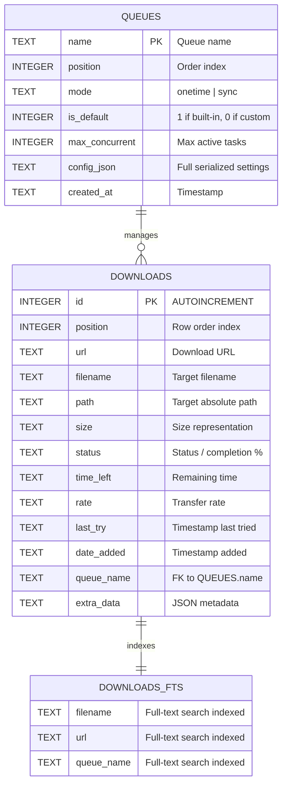

# Bengal Download Manager: SQLite Database & Performance Optimization Plan

This document outlines the architecture, database schema, migration strategy, and system-wide performance optimizations for transitioning Bengal Download Manager from JSON file storage to a high-performance SQLite engine with optimized I/O and UI pipelines.

---

## 1. SQLite Database Architecture & Schema

### 1.1 Database Configuration & Pragmas
* **File Location**: `os.path.join(get_data_dir(), "downloads.db")`
* **Core Pragmas**:
  ```sql
  PRAGMA journal_mode = WAL;
  PRAGMA synchronous = NORMAL;
  PRAGMA foreign_keys = ON;
  PRAGMA cache_size = -64000; -- 64MB memory cache
  PRAGMA busy_timeout = 5000;
  PRAGMA temp_store = MEMORY;
  ```

### 1.2 Schema Definition



#### SQL Table Definitions
```sql
CREATE TABLE IF NOT EXISTS queues (
    name TEXT PRIMARY KEY,
    position INTEGER NOT NULL DEFAULT 0,
    mode TEXT NOT NULL DEFAULT 'onetime',
    is_default INTEGER NOT NULL DEFAULT 0,
    max_concurrent INTEGER NOT NULL DEFAULT 4,
    config_json TEXT NOT NULL DEFAULT '{}',
    created_at TEXT NOT NULL
);

CREATE TABLE IF NOT EXISTS downloads (
    id INTEGER PRIMARY KEY AUTOINCREMENT,
    position INTEGER NOT NULL DEFAULT 0,
    url TEXT NOT NULL,
    filename TEXT NOT NULL,
    path TEXT NOT NULL,
    size TEXT NOT NULL DEFAULT '',
    status TEXT NOT NULL DEFAULT 'Queued',
    time_left TEXT NOT NULL DEFAULT '',
    rate TEXT NOT NULL DEFAULT '',
    last_try TEXT NOT NULL DEFAULT '',
    date_added TEXT NOT NULL DEFAULT '',
    queue_name TEXT NOT NULL DEFAULT 'Main download queue',
    extra_data TEXT NOT NULL DEFAULT '{}',
    FOREIGN KEY(queue_name) REFERENCES queues(name) ON UPDATE CASCADE ON DELETE SET DEFAULT
);

CREATE INDEX IF NOT EXISTS idx_downloads_status_queue ON downloads (status, queue_name);
CREATE INDEX IF NOT EXISTS idx_downloads_position ON downloads (position ASC);
CREATE INDEX IF NOT EXISTS idx_downloads_date_added ON downloads (date_added DESC);

-- FTS5 Full-Text Search Virtual Table
CREATE VIRTUAL TABLE IF NOT EXISTS downloads_fts USING fts5(
    filename,
    url,
    queue_name,
    content='downloads',
    content_rowid='id'
);

-- Triggers for keeping FTS5 in sync
CREATE TRIGGER IF NOT EXISTS downloads_ai AFTER INSERT ON downloads BEGIN
    INSERT INTO downloads_fts(rowid, filename, url, queue_name)
    VALUES (new.id, new.filename, new.url, new.queue_name);
END;

CREATE TRIGGER IF NOT EXISTS downloads_ad AFTER DELETE ON downloads BEGIN
    INSERT INTO downloads_fts(downloads_fts, rowid, filename, url, queue_name)
    VALUES('delete', old.id, old.filename, old.url, old.queue_name);
END;

CREATE TRIGGER IF NOT EXISTS downloads_au AFTER UPDATE ON downloads BEGIN
    INSERT INTO downloads_fts(downloads_fts, rowid, filename, url, queue_name)
    VALUES('delete', old.id, old.filename, old.url, old.queue_name);
    INSERT INTO downloads_fts(rowid, filename, url, queue_name)
    VALUES (new.id, new.filename, new.url, new.queue_name);
END;
```

---

## 2. High-Impact Performance Optimizations

### 3.1 Asynchronous Dirty Write Buffer
* Avoid frequent disk I/O on rapid progress updates (e.g. 50+ events/sec across connections).
* Maintain in-memory download state cache with a debounced 1.0s background commit queue.
* Flush immediately on application exit, download completion, pause/resume, or error.

### 3.2 Model/View Virtualization (`QAbstractTableModel`)
* Current state: `QTableWidget` creates ~8 `QTableWidgetItem` heap objects per row (80,000 Qt objects for 10k rows).
* Optimized state: `QTableView` + `QAbstractTableModel` querying memory array or SQLite slice directly.
* Memory usage drops from `~120 MB` to `< 8 MB`; instant 60 FPS sorting and viewport scrolling.

### 3.3 Disk & Network I/O Enhancements
* **File Pre-allocation**: Use `posix_fallocate()` on Linux/Unix before chunk writing to prevent filesystem fragmentation and allocate contiguous disk space.
* **Concurrent Direct Slicing**: Use `os.pwrite()` to write chunks directly at their exact byte offsets without lock contention or sequential seek overhead.
* **Adaptive Buffer Sizing**: Scale buffer dynamically from `64 KB` to `2 MB` according to connection throughput.
* **Socket Buffer Tuning**: Set `socket.SO_RCVBUF` to `1 MB` for high-throughput connections.

### 3.4 UI Paint Event Coalescing
* Consolidate progress bar repaint events to a centralized 100ms timer rather than emitting Qt signals per chunk packet.
* Viewport row culling: bypass style calculations and icon lookups for non-visible rows.

---

## 4. Execution Phases

| Phase | Objective | Scope |
|---|---|---|
| **Phase 1** | Core SQLite Engine & Migration | Create `src/core/database.py`, tables, indexes, CRUD, and JSON migration. |
| **Phase 2** | UI Main Window & Scheduler Integration | Wire `MainWindow` & `SchedulerDialog` to SQLite persistence layer. |
| **Phase 3** | Automated Testing & Validation | Unit and integration tests for SQLite CRUD, transactions, and UI workflows. |
| **Phase 4** | Advanced Optimizations | Dirty write debounce, FTS5 instant search, and `posix_fallocate` disk pre-allocation. |
